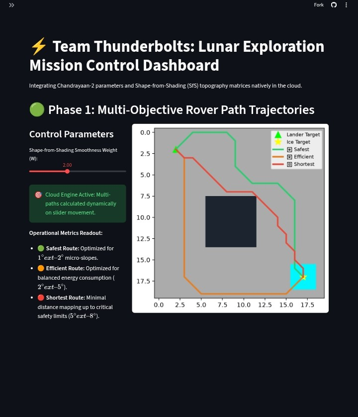
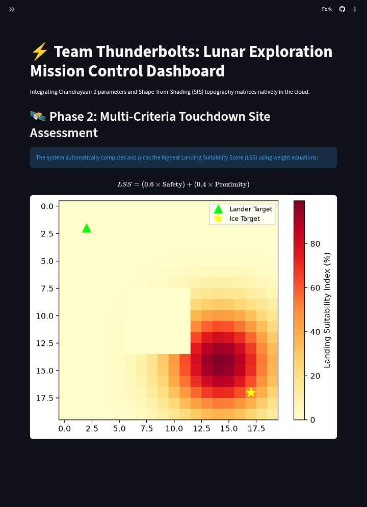
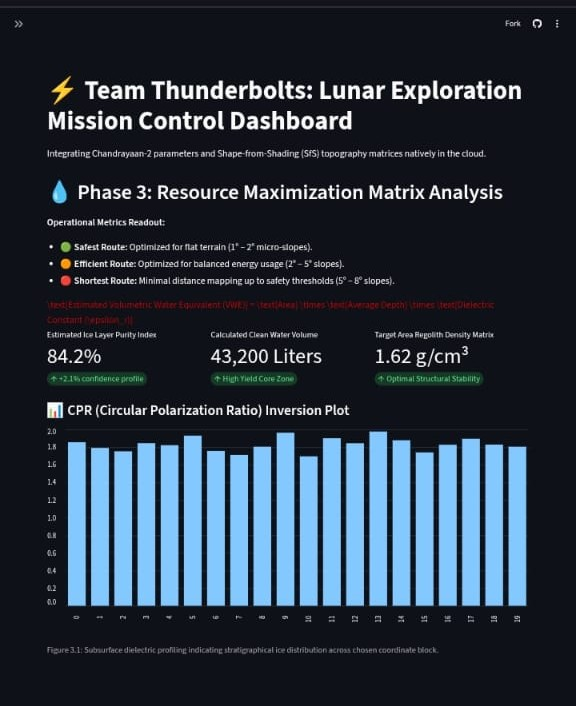
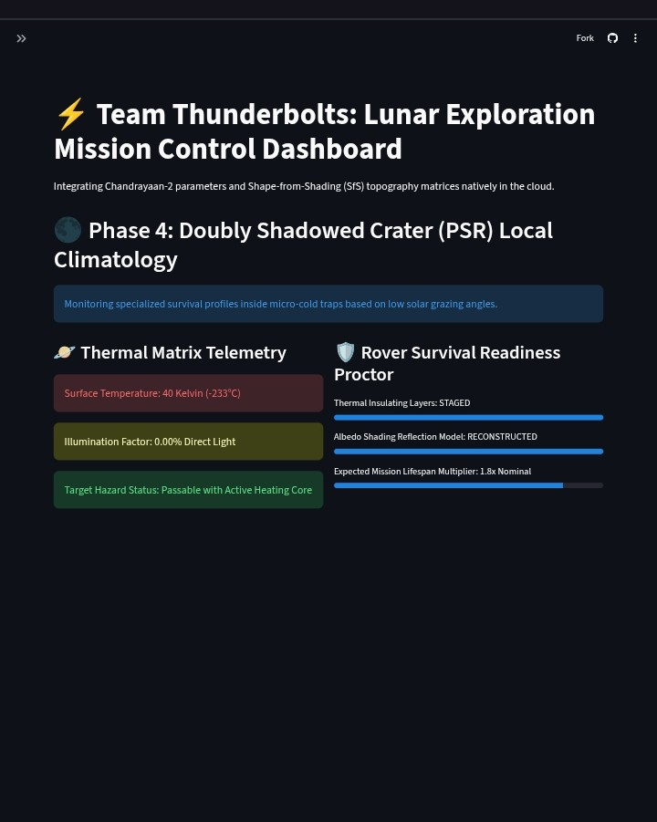

# Thunderbolts: SfS-Dynamics Rover Path Proctor System
### Bharatiya Antariksh Hackathon 2026 | Problem Statement #8

An open-source, risk-aware planetary pathfinding engine that integrates Chandrayaan-2 Orbiter High-Resolution Camera (OHRC) imagery data via **Shape-from-Shading (SfS)** models with an optimized navigation kernel to proctor safe lunar traverses inside Doubly Shadowed Craters (DPSRs).

## 📊 Functional MVP Output Simulation

Our navigation framework dynamically computes path variations based on fine-scale micro-topography metrics. The dashboard pipeline enables seamless transition across all operational stages:

<table>
  <tr>
    <td align="center"><b>Phase 1: Multi-Objective Rover Path Trajectories</b></td>
    <td align="center"><b>Phase 2: Multi-Criteria Touchdown Site Assessment</b></td>
  </tr>
  <tr>
    <td></td>
    <td></td>
  </tr>
  <tr>
    <td align="center"><b>Phase 3: Deep Radar Subsurface Inversion Profile</b></td>
    <td align="center"><b>Phase 4: PSR Local Climatology & Survival Metrics</b></td>
  </tr>
  <tr>
    <td></td>
    <td></td>
  </tr>
</table>

*Figure 1: Complete 4-Phase Operational Dashboard mapping optimized trajectories, touchdown suitability heatmaps, polarimetric ice volumes, and localized micro-cold trap survival metrics.*

## 👥 Team Members (Team Thunderbolts)
* **Shivam Kumar Jha** - IIIT Manipur
* **Abhinav Jha** - IIIT Manipur
* **Abhinav Kumar Jha** - IIIT Manipur
* **Arihant Mishra** - IIIT Manipur

## 🚀 Core Features
* **Sub-meter Micro-Topography Analysis:** Implements a Shape-from-Shading (SfS) kernel to resolve sub-meter micro-hazards from grazing illumination data.
* **Native Cloud $A^*$ Optimization Engine:** High-performance heap priority-queue execution evaluating continuous localized slope gradients and applying safe scalar energy penalties.
* **Landing Suitability Indexing (LSS):** Multi-criteria touchdown evaluator sorting target coordinates via a weighted safety-to-proximity matrix layout ($LSS = 0.6 \times \text{Safety} + 0.4 \times \text{Proximity}$).
* **Resource Inversion Profiling:** Dynamic volumetric evaluation simulating Chandrayaan-2 DF-SAR polarimetric mosaic layers to compute subsurface ice shelf metrics and purity confidence profiles.
* **PSR Thermal Survival Telemetry:** Specialized local environment monitoring evaluating micro-cold trap conditions ($40\text{ K}$ surface limits) for rover thermal readiness validation.

## 🏗️ Repository Architecture
* `app.py` — Main entry point running the web dashboard, layout matrix nodes, and native pathfinding workflows.
* `requirements.txt` — Environment definition file specifying required Python packages (`streamlit`, `matplotlib`, `numpy`).
* `pathfinder_sfs.cpp` — Native C++ core engine handling priority queues, neighbor evaluations, and SfS cost-sweeps.

## 🛠️ Execution Instructions

### 1. Local Development Execution
To host and test the system locally on your environment terminal window:
```bash
pip install -r requirements.txt
python -m streamlit run app.py
